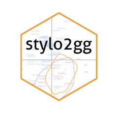

# stylo2gg <a href="https://jmclawson.github.io/stylo2gg/"></a>
Visualize and explore stylo data using ggplot2.

## Installation
Using the remotes package, install stylo2gg with the following command:

```{r}
remotes::install_github("jmclawson/stylo2gg")
```

## Use
Pipe the output from `stylo()` into `stylo2gg()`, or save it as an object reused by the `stylo2gg()` function:

```{r}
# pipe it directly
stylo() |> stylo2gg

# or save it as an object to use and re-use later
my_data <- stylo()
stylo2gg(my_data)
```

## Further details
For more explanation on use, see the [introductory blog post](https://jmclawson.net/blog/posts/introducing-stylo2gg/), the function [reference pages](https://jmclawson.github.io/stylo2gg/reference/index.html) or the [package website](https://jmclawson.github.io/stylo2gg).

<!--
## Options

### Principal Components Analysis
Set `viz="pca"` for a minimal display of word frequencies using principal components analysis, or use `viz="PCR"` or `viz="PCV"` for stylo-themed visualizations using ggplot2. 

### Hierarchical Clustering
Set `viz="hc"` for a minimal display of a dendrogram with a cluster analysis of text distances, or use `viz="CA"` for a stylo-themed visualization using ggplot2. 

### Other options
Set `labeling=` to a number corresponding to an index of metadata encoded in texts' filenames. For instance, "Joyce_Ulysses_1922.txt" using the option `stylo2gg(labeling=2)` would display as "Ulysses", `stylo2gg(labeling=3)` would display as "1922", and `stylo2gg(labeling=0)` would display as "Joyce_Ulysses_1922".

Use `shapes=FALSE` and `shapes=TRUE` to toggle symbols on and off of a visualization.

Set `highlight=` to a number or numbers corresponding to the legend index of a certain category of work. For example, `highlight=1` will draw a circle around or a box around texts attributed to the first author in the legend.
-->
